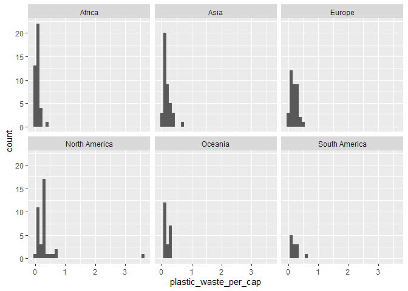
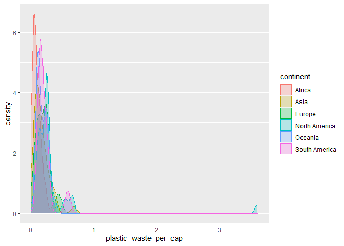
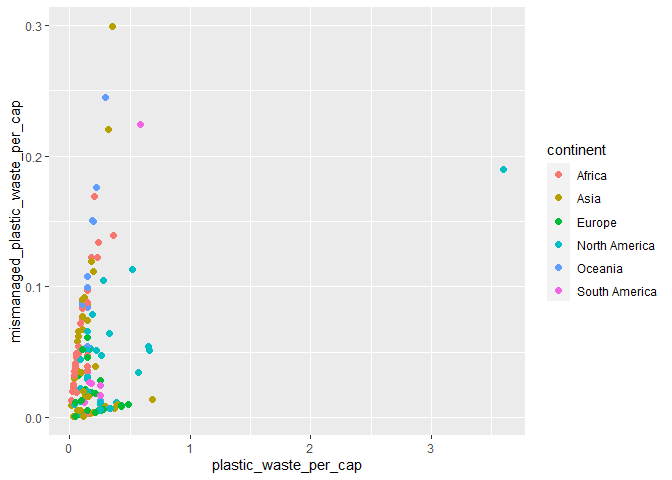
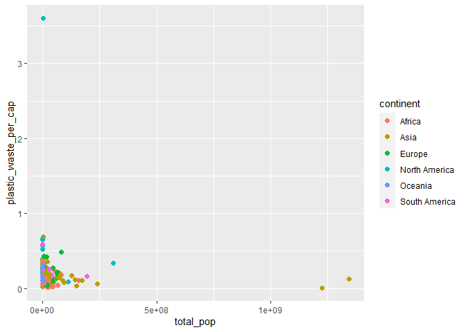
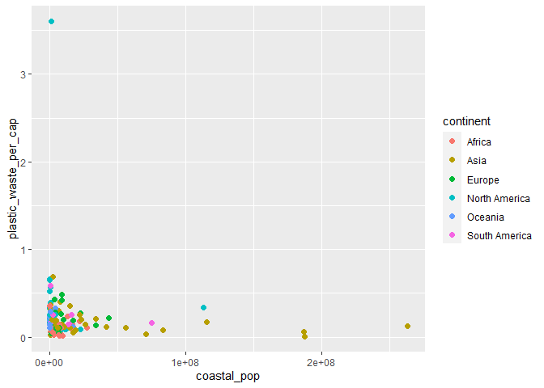
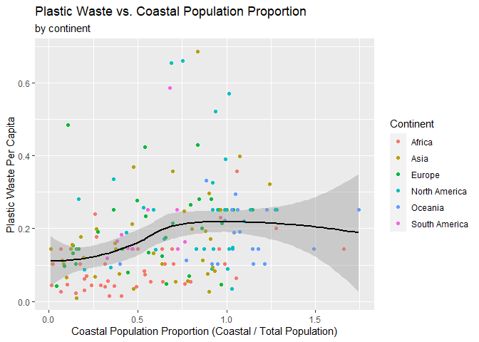

Lab 02 - Plastic waste
================
Bob Dwyer
Sys. Date()

## Load packages and data

``` r
library(tidyverse) 
```

``` r
plastic_waste <- read.csv("data/plastic-waste.csv")
```

## Exercises

### Exercise 1

#### The largest plastic waste per capital belongs to Tinidad & Tobago (N.America). Forbes states that “Inadequate waste management is at the root of the problem.”

``` r
plastic_waste %>% 
  ggplot(aes(x = plastic_waste_per_cap)) +
  geom_histogram(binwidth = .1) +
  facet_wrap(~ continent)
```

    ## Warning: Removed 51 rows containing non-finite values (stat_bin).

<!-- -->

### Exercise 2

#### Describe why we defined the color and fill of the curves by mapping aesthetics of the plot but we defined the alpha level as a characteristic of the plotting geom.

##### Answer: Color and fill are assigned to specific variables, whereas, adding the alpha aesthetic to a geom assigned the aesthetic universally, and can almost be thought of as a graph setting.

``` r
ggplot(data = plastic_waste, 
       mapping = aes(x = plastic_waste_per_cap, 
                     color = continent, 
                     fill = continent)) +
  geom_density(alpha = 0.25)
```

    ## Warning: Removed 51 rows containing non-finite values (stat_density).

<!-- -->

### Exercise 3

#### What features are apparent in the box plots but not in the violin plots?

##### Answer: A violin plot in addition to showing distribution / summary statistics, visually, it also shows density.

``` r
plastic_waste %>% 
  ggplot(aes(x = continent, y = plastic_waste_per_cap)) +
  geom_violin()
```

    ## Warning: Removed 51 rows containing non-finite values (stat_ydensity).

<!-- -->

### Exercise 4

#### Visualize the relationship between plastic waste per capita and mismanaged plastic waste per capita using a scatterplot. Describe the relationship.

##### There is a direct, postive relationship.

#### Does there seem to be any clear distinctions between continents with respect to how plastic waste per capita and mismanaged plastic waste per capita are associated?

##### The story is that as plastic_waste_per_cap increases, so does the amount of mismangaged plastic waste. However, we do see that on some continents, the amount of mismangaged waste increases at a slower rate (e.g., North America, Europe)

``` r
plastic_waste %>% 
  ggplot(aes(x = plastic_waste_per_cap, 
             y = mismanaged_plastic_waste_per_cap, color = continent)) +
  geom_point(size = 2)
```

    ## Warning: Removed 51 rows containing missing values (geom_point).

<!-- -->

### Exercise 5

Remove this text, and add your answer for Exercise 5 here.

``` r
# This figure is above. There is a mis-match between the code and the assignement on the website.
```

### Exercise 6

Remove this text, and add your answer for Exercise 6 here.

``` r
# This figure is above. There is a mis-match between the code and the assignement on the website.
```

### Exercise 7

#### There does not seem to be a strong linear relationship here.

``` r
plastic_waste %>% 
  ggplot(aes(x = total_pop, 
             y = plastic_waste_per_cap, color = continent)) +
  geom_point(size = 2)
```

    ## Warning: Removed 61 rows containing missing values (geom_point).

<!-- -->

``` r
plastic_waste %>% 
  ggplot(aes(x = coastal_pop, 
             y = plastic_waste_per_cap, color = continent)) +
  geom_point(size = 2)
```

    ## Warning: Removed 51 rows containing missing values (geom_point).

<!-- -->

### Exercise 8

Remove this text, and add your answer for Exercise 8 here.

``` r
plastic_waste %>% 
  mutate(coast_pop_prop = coastal_pop / total_pop) %>% 
  filter(plastic_waste_per_cap < 1.0) %>% 
  ggplot(aes(x = coast_pop_prop, 
             y = plastic_waste_per_cap)) +
  geom_point(aes(color = continent)) + 
  geom_smooth(color = "black") +
  labs(title = "Plastic Waste vs. Coastal Population Proportion",
       subtitle = "by continent",
       x = "Coastal Population Proportion (Coastal / Total Population)",
       y = "Plastic Waste Per Capita",
       color = "Continent")
```

    ## `geom_smooth()` using method = 'loess' and formula 'y ~ x'

    ## Warning: Removed 10 rows containing non-finite values (stat_smooth).

    ## Warning: Removed 10 rows containing missing values (geom_point).

<!-- -->

## Pro-Tips

### Excercise 3

Try this :D

``` r
ggplot(data = plastic_waste, 
       mapping = aes(x = continent, 
                     y = plastic_waste_per_cap)) +
  geom_violin()+
  geom_boxplot(width=.3, fill="green") +
  stat_summary(fun.y=median, geom="point") 
```

    ## Warning: `fun.y` is deprecated. Use `fun` instead.

    ## Warning: Removed 51 rows containing non-finite values (stat_ydensity).

    ## Warning: Removed 51 rows containing non-finite values (stat_boxplot).

    ## Warning: Removed 51 rows containing non-finite values (stat_summary).

<!-- -->

### Exercise 5

Helpful
reference:<http://www.sthda.com/english/wiki/ggplot2-themes-and-background-colors-the-3-elements>
